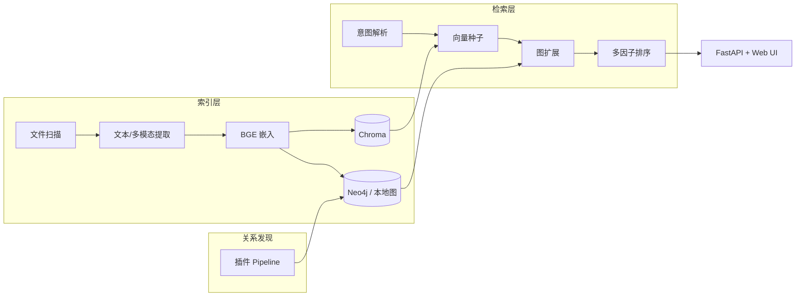

# FileKG — 个人文件知识图谱

> 仓库名 **File-Describer**，项目代号 **FileKG**（Personal File Knowledge Graph）  
> English: [README.en.md](README.en.md)

[](LICENSE)
[](https://github.com/S1M0nLEE/File-Describer/actions/workflows/ci.yml)

基于虚拟文件实体（VFE）的个人文件智能索引、检索与关系导航系统：自动发现 12+ 种文件间关系，支持「向量种子 + 图扩展 + 多因子排序」的**可解释**混合检索。

## 5 分钟体验（Quick Demo）

```bash
git clone https://github.com/S1M0nLEE/File-Describer.git
cd File-Describer
python3.12 -m venv .venv && source .venv/bin/activate   # Windows: .venv\Scripts\activate
pip install -r requirements.txt
python scripts/setup_models.py
python scripts/generate_dataset.py
python scripts/index_directory.py data/dataset --clear
python scripts/run_server.py
```

浏览器打开 **http://localhost:8765**，在检索页尝试：

- `实验数据`
- `处理实验数据的 python 代码`
- `论文最新版本`

系统会返回排序结果及**关系路径**（如 `DEPENDS_ON`、`HAS_VERSION`）。

## 界面预览

| 检索与关系路径 | 知识图谱可视化 |
|----------------|----------------|
|  |  |

> 截图由 `scripts/generate_dataset.py` + 本地索引生成。更新截图：`python scripts/run_server.py` 后访问 UI 并替换 `docs/assets/` 下 PNG。

## 核心指标（合成/混合基准，`tois_eval` 口径）

| 指标 | 数值 | 说明 |
|------|------|------|
| 关系保持率（文件移动后） | **97.9%** | volume 级 `file_id` 鲁棒性 |
| SDR@20（代码依赖场景） | **0.522** | 多关系「意外发现」优势最明显 |
| MAP@20（合成主基准） | **0.691** | 与最强向量基线接近 |

复现命令：

```bash
python scripts/generate_evaluation_benchmark.py
export FILEKG_CONFIG=config_tois_eval.yaml
python scripts/run_evaluation.py --dataset code_dependency
python scripts/run_robustness.py
```

结果输出到本地 `data/evaluation/`（不入库）。指标解读见 [docs/ARCHITECTURE.md](docs/ARCHITECTURE.md)。

## 架构



| 模块 | 技术 | 职责 |
|------|------|------|
| FileDescriptor | 图节点 | 摘要、向量、生命周期、file_id |
| 向量检索 | Chroma | 分块 ANN + 文件级嵌入 |
| 关系发现 | 插件 Pipeline | 12+ 关系类型 |
| 检索 | FastAPI | 意图 → 种子 → 图扩展 → 排序 |

已实现关系：`IN_FOLDER`, `SAME_TYPE`, `NEAR_IN_TIME`, `SIMILAR_TO`, `HAS_VERSION`, `DEPENDS_ON`, `REFERENCES`, `CONTAINS`, `WORKFLOW_WITH`, `BELONGS_TO_PROJECT`, `TAGGED_WITH` 等。

## 安装

### 核心依赖（必装）

```bash
pip install -r requirements.txt
cp .env.example .env    # 可选：DEEPSEEK_API_KEY
python scripts/setup_models.py
```

| 嵌入后端 | 说明 |
|----------|------|
| `sentence_transformers` | 默认，BGE 中文 512 维 |
| `fastembed` | ONNX 备选 |
| `hash` | 无模型占位，仅联调 |

### 可选：视觉 / 多模态（约 2GB+）

```bash
pip install -r requirements-visual.txt
python scripts/setup_multimodal.py   # 需本地 Ollama
```

## 日常使用

### 索引目录

```bash
python scripts/index_directory.py ~/Documents/research
# 或 API: curl -X POST http://localhost:8765/index -H 'Content-Type: application/json' -d '{"path":"/path/to/dir"}'
```

### 启动服务

```bash
python scripts/run_server.py
# API 文档: http://localhost:8765/docs
```

### Neo4j（可选）

无 Docker 时使用本地 `data/graph_store.json`。有 Docker：

```bash
docker compose up -d
# http://localhost:7474  用户 neo4j / 密码见 docker-compose.yml
```

### DeepSeek RAG（可选）

在 `.env` 设置 `DEEPSEEK_API_KEY`，然后：

```bash
python scripts/setup_rag.py
python scripts/index_local_pc.py
```

## 检索示例

| 查询 | 系统行为 |
|------|----------|
| `项目A的论文最新版本` | 版本关系 + 语义排序 |
| `处理实验数据的代码` | `.py` 意图 + DEPENDS_ON 扩展 |
| `上周修改的 pdf` | 时间过滤 + 向量种子 |

## 项目结构

```
src/indexing/    扫描、提取、嵌入、file_id
src/relations/   关系发现 Pipeline
src/search/      意图解析、图扩展、排序
src/storage/     Chroma + 图存储
src/api/         FastAPI + Web UI
scripts/         索引、评测、工具
docs/            架构、Roadmap、GitHub 设置说明
tests/           单元与 smoke 测试
```

## 文档

- [架构说明](docs/ARCHITECTURE.md)
- [Roadmap](docs/ROADMAP.md)
- [GitHub 仓库设置（Description / Topics）](docs/GITHUB_SETUP.md)

## 测试

```bash
pytest tests/ -q
```

## License

MIT — 见 [LICENSE](LICENSE)。
