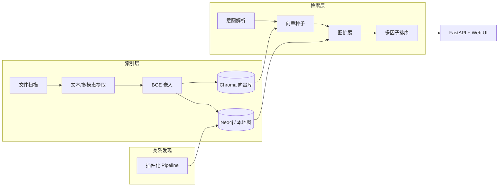

# FileKG — 个人文件知识图谱

> 仓库名 **File-Describer**，项目代号 **FileKG**（Personal File Knowledge Graph）。

[](LICENSE)

基于虚拟文件实体（VFE）的个人文件智能索引、检索与关系导航系统：自动发现 12+ 种文件间关系，支持「向量种子 + 图扩展 + 多因子排序」的可解释混合检索。

## 核心指标（合成/混合基准，`tois_eval` 口径）

| 指标 | 数值 |
|------|------|
| 关系保持率（文件移动后） | **97.9%** |
| SDR@20（代码依赖场景） | **0.522** |
| MAP@20（合成主基准） | **0.691** |

完整评测请运行 `scripts/run_evaluation.py`，结果输出到本地 `data/evaluation/`（不入库）。

## 架构



| 模块 | 技术 | 职责 |
|------|------|------|
| FileDescriptor | Neo4j 节点 | 文件数字代理：摘要、向量、生命周期、file_id |
| 向量检索 | Chroma | 分块 ANN + 文件级嵌入 |
| 关系发现 | 插件化 Pipeline | 12+ 种关系自动构建 |
| 检索 | FastAPI | 意图解析 → 种子定位 → 图扩展 → 多因子排序 |

## 已实现关系类型

`IN_FOLDER`, `SAME_TYPE`, `NEAR_IN_TIME`, `SIMILAR_TO`, `HAS_VERSION`, `IS_PREVIOUS_VERSION_OF`, `DEPENDS_ON`, `REFERENCES`, `CONTAINS`, `WORKFLOW_WITH`, `IS_TEMPORARY_OF`, `IS_BACKUP_OF`, `BELONGS_TO_PROJECT`, `TAGGED_WITH`

> `VISUALLY_SIMILAR_TO` / `NEAR_DUPLICATE` 由 **多路融合** 发现（OCR + 文档页 + CLIP + pHash）。需 `visual.enabled: true` 并安装 `requirements-visual.txt`。

## 本地多模态检索（文档 / 图片 / 视频 / 音频）

开启 `config.yaml` 中 `multimodal.enabled` 后：

| 模态 | 索引方式 | 模糊语义检索 |
|------|----------|--------------|
| 文档/邮件/代码 | 抽文本 → BGE | ✅ |
| 图片/截图/风景照 | Ollama **moondream** 描述 + **CLIP** 向量 | ✅ 文字 + 视觉双路 |
| 视频 | 抽帧 + moondream 描述 + **whisper** 转写 | ✅ |
| 音频 | Ollama **whisper** 转写 → BGE | ✅ |

首次使用：

```bash
pip install -r requirements-visual.txt
python scripts/setup_multimodal.py
```

需本地 **Ollama** 运行中；视频抽帧优先用 OpenCV，无则尝试系统 `ffmpeg`。

## 专利实施例补强

```powershell
# 全功能配置 + 关系审计(300条模板) + 文档包
python scripts/run_patent_embodiment.py --quick

# 单独跑英文 HippoCamp 实施例
python scripts/run_evaluation.py --registry real --dataset hippocamp_adam --profile hippocamp_en --results-dir results_patent_embodiment
```

文档：`data/evaluation/patent/`（权利要求对照表、附图、实施例指标说明）

## 快速开始

### 1. 安装依赖（推荐 Python 3.12 虚拟环境）

```bash
git clone https://github.com/S1M0nLEE/File-Describer.git
cd File-Describer
python3.12 -m venv .venv
source .venv/bin/activate          # Windows: .venv\Scripts\activate
pip install -r requirements.txt
cp .env.example .env
```

**可选**（视觉/多模态，约 2GB+）：

```bash
pip install -r requirements-visual.txt
```

### 1b. 验证模型

```bash
python scripts/setup_models.py
```

成功时应显示 `embedding_backend: sentence_transformers`，向量维度 512。

| 后端 | 说明 |
|------|------|
| `sentence_transformers` | 默认优先，与文档一致（需 Python ≤3.12） |
| `fastembed` | ONNX 备选，支持 Python 3.14 |
| `hash` | 无模型时的占位，检索质量差 |

可在 `config.yaml` 或环境变量 `FILEKG_EMBEDDING_BACKEND` 中指定。

### 2. （可选）启动 Neo4j

未安装 Docker 时，系统会自动使用本地 `data/graph_store.json` 作为图存储，无需 Neo4j 即可运行。

若已安装 Docker：

```bash
docker compose up -d
```

浏览器访问 http://localhost:7474 （用户 `neo4j` / 密码 `filekg123`）

### 3. 生成示例数据集并索引

```bash
python scripts/generate_dataset.py
python scripts/index_directory.py data/dataset --clear
```

### 4. 启动服务

```bash
python scripts/run_server.py
```

打开 http://localhost:8765 使用 Web 前端（**智能问答 RAG** / 检索 / 索引 / 文件列表 / 系统维护），API 文档见 http://localhost:8765/docs

### DeepSeek RAG（本机文件问答）

1. API Key 已写入项目根目录 `.env`（`DEEPSEEK_API_KEY`）
2. 安装并自检：`python scripts/setup_rag.py`（已验证 deepseek-v4-pro 可连通）
3. **索引本机数据**（Documents/Desktop/Downloads 等，可在 `config.yaml` → `rag.index_roots` 调整）：

```powershell
python scripts/index_local_pc.py          # 增量索引
python scripts/index_local_pc.py --clear  # 清空后全量重建
```

4. 启动服务后在浏览器打开 **「智能问答」** 页，或调用 `POST /rag/chat`

```json
{"question": "我有哪些合同相关的 PDF？", "stream": false}
```

### 5. 索引你自己的目录

```bash
python scripts/index_directory.py "D:\Documents\research"
```

或通过 API：

```bash
curl -X POST http://localhost:8765/index -H "Content-Type: application/json" -d "{\"path\": \"D:\\\\Documents\"}"
```

## 检索示例

- `项目A的论文最新版本`
- `处理实验数据的代码`
- `上周修改的 pdf 实验`

系统会：解析时间/类型条件 → Chroma 向量找种子 → Neo4j 1 跳图扩展 → 综合排序并返回推理路径。

## 增量监控

```bash
curl -X POST http://localhost:8765/watch -H "Content-Type: application/json" -d "[\"D:\\\\Documents\"]"
```

文件创建/修改/移动时自动更新索引；移动/重命名通过 Windows `file_id` 保持关系不断裂。

## 配置

编辑 `config.yaml` 可调整 Neo4j、相似度阈值、排序权重、关系传播权重等。

## 项目结构

```
src/
  models/          # FileDescriptor、关系枚举
  indexing/        # 扫描、文本提取、嵌入、file_id
  relations/       # 关系发现插件与管线
  storage/         # Neo4j + Chroma
  search/          # 意图解析、图扩展、排序
  api/             # FastAPI + Web UI
  watcher/         # watchdog 增量更新
scripts/           # 索引、数据集、服务启动
```

## 对比实验（方案第八章）

### 数据集

| ID | 名称 | 查询数 | 说明 |
|----|------|--------|------|
| `filekg_main` | FileKG 合成主基准 | 40 | 四场景 A-D + 200 噪声文件，复现方案 8.2 |
| `code_dependency` | 工程依赖专项 | 15 | 验证 `DEPENDS_ON` 关系 |
| `personal_mixed` | 跨场景混合 | 12 | 科研 + 财务混合检索 |
| `hippocamp_adam` | HippoCamp Adam-Subset | 18 | 真实个人文件（需额外下载） |

### 运行实验（专利举证一键流水线）

```powershell
.venv\Scripts\python.exe scripts\run_patent_pipeline.py
```

或分步执行：

```powershell
.venv\Scripts\python.exe scripts\generate_evaluation_benchmark.py
.venv\Scripts\python.exe scripts\run_evaluation.py --all
.venv\Scripts\python.exe scripts\run_ablation.py
.venv\Scripts\python.exe scripts\run_relation_audit.py    # 关系精确率（规则 Oracle）
.venv\Scripts\python.exe scripts\run_robustness.py        # file_id 移动鲁棒性
.venv\Scripts\python.exe scripts\export_experiment_data.py
.venv\Scripts\python.exe scripts\generate_experiment_report.py
.venv\Scripts\python.exe scripts\download_hippocamp_subset.py  # 可选真实数据
```

结果输出：`data/evaluation/results_corrected_v2/`（`metrics.json`、`comparison_summary.json`、`robustness.json`、`relation_precision.json`）；汇总报告 `data/evaluation/EXPERIMENT_REPORT.md`。

### 基线方法

BM25 · 纯向量 · 向量+元数据过滤 · 向量+仅 SIMILAR_TO · **FileKG 完整方案**
