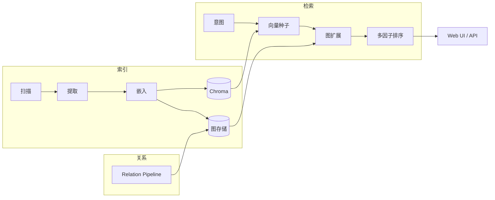

# FileKG — 个人文件知识图谱

> 仓库名 **File-Describer**，项目代号 **FileKG**（Personal File Knowledge Graph）  
> English: [README.en.md](README.en.md)

[](LICENSE)
[](https://github.com/S1M0nLEE/File-Describer/actions/workflows/ci.yml)

本地文件夹往往只有路径和文件名，缺少「这份合同和哪几份判例相关」「哪个脚本是论文终稿的数据处理入口」这类语义与结构信息。FileKG 把磁盘上的文件建成**虚拟文件实体（VFE）**，自动发现文件之间的多种关系，并提供**可解释的混合检索**：先用向量找种子文件，再沿知识图谱扩展，最后按语义、图结构、时间、规则等多因子排序。

适合作为个人文件助手、研究资料库或小型团队文档库的后端；自带 Web UI 与 REST API。

## 功能概览

- **索引**：递归扫描目录，提取文本/元数据（可选多模态），写入 Chroma 向量库与图存储
- **关系发现**：插件化 Pipeline，支持 `IN_FOLDER`、`SIMILAR_TO`、`DEPENDS_ON`、`REFERENCES`、`HAS_VERSION`、`WORKFLOW_WITH` 等 12+ 种关系
- **检索**：自然语言查询 → 意图解析 → 向量种子 → 图扩展 → 多因子排序，返回**关系路径**而不仅是文件名列表
- **稳定 file_id**：默认 volume 模式（inode / Windows File ID），移动或重命名后关系尽量保留
- **可选能力**：Neo4j 图库、DeepSeek RAG、视觉/多模态关系（按需安装）

## 快速开始

```bash
git clone https://github.com/S1M0nLEE/File-Describer.git
cd File-Describer
python3.12 -m venv .venv && source .venv/bin/activate   # Windows: .venv\Scripts\activate
pip install -r requirements.txt
python scripts/setup_models.py
python scripts/generate_dataset.py
python scripts/index_directory.py data/dataset --clear
python scripts/run_server.py
```

浏览器打开 **http://127.0.0.1:8765**。服务启动后会后台加载索引与检索引擎。可尝试：

- `实验数据`
- `处理实验数据的 python 代码`
- `论文最新版本`

结果中会展示排序得分及解释路径（如 `DEPENDS_ON`、`HAS_VERSION`）。

### Docker 演示

无本地 Python 时可用 hash 嵌入快速看 UI（语义质量不如完整安装）：

```bash
chmod +x scripts/docker-demo.sh && ./scripts/docker-demo.sh
# 或: docker compose up --build -d filekg
```

可选 Neo4j：`docker compose --profile neo4j up -d neo4j`

## 界面预览

| 检索与关系路径 | 知识图谱可视化 |
|----------------|----------------|
|  |  |

截图由 `scripts/generate_dataset.py` 与本地索引生成。

## 工作原理



| 层次 | 目录 | 说明 |
|------|------|------|
| 索引 | `src/indexing/` | 扫描、摘要、句向量、file_id |
| 关系 | `src/relations/` | 可扩展 Parser，批量写边 |
| 检索 | `src/search/` | 意图 → 种子 → 扩展 → 排序 |
| 存储 | `src/storage/` | Chroma + 本地 JSON 图 / Neo4j |
| 接口 | `src/api/` | FastAPI 路由与静态前端 |

更细的模块说明见 [docs/ARCHITECTURE.md](docs/ARCHITECTURE.md)。

## 安装与配置

### 核心依赖

```bash
pip install -r requirements.txt
cp .env.example .env    # 可选：DEEPSEEK_API_KEY、HF_ENDPOINT
python scripts/setup_models.py
```

| 嵌入后端 | 说明 |
|----------|------|
| `sentence_transformers` | 默认，`all-MiniLM-L6-v2` |
| `fastembed` | ONNX 备选 |
| `hash` | 无模型占位，CI / Docker 演示 |

### 可选：视觉与多模态

```bash
pip install -r requirements-visual.txt
python scripts/setup_multimodal.py   # 部分能力需本地 Ollama
```

### 索引与检索

```bash
# 索引任意目录
python scripts/index_directory.py ~/Documents/research

# 或通过 API
curl -X POST http://127.0.0.1:8765/index \
  -H 'Content-Type: application/json' \
  -d '{"path":"/path/to/dir"}'
```

默认仅监听 `127.0.0.1`。对外暴露或 Docker 映射端口时建议启用 API Token，见 [docs/SECURITY.md](docs/SECURITY.md)。

### 可选：Neo4j 与 RAG

```bash
docker compose --profile neo4j up -d neo4j
# 在 .env 配置 DEEPSEEK_API_KEY 后
python scripts/setup_rag.py
python scripts/index_local_pc.py
```

## 检索示例

| 查询 | 典型行为 |
|------|----------|
| `项目A的论文最新版本` | 版本关系 + 语义排序 |
| `处理实验数据的代码` | 识别 `.py` 意图，沿 `DEPENDS_ON` 扩展 |
| `上周修改的 pdf` | 时间过滤 + 向量种子 |

## 评测

项目包含可复现的离线评测脚本，用于对比 BM25、纯向量、图增强与 FileKG-Full 等基线。指标定义与复现步骤见 [docs/EVALUATION.md](docs/EVALUATION.md)。

### 合成 benchmark

受控数据集（`filekg_main`、`code_dependency` 等），便于回归与消融。公开快照：[docs/evaluation_snapshot.json](docs/evaluation_snapshot.json)

| 指标 | FileKG-Full | 数据集 |
|------|-------------|--------|
| MAP@20 | 0.691 | `filekg_main`（238 文件 / 40 查询） |
| Serendipity@20 | 0.522 | `code_dependency`（15 查询） |
| 关系保持率 | 97.85% | 移动 8 文件后 volume `file_id` 边保留 |

```bash
python scripts/generate_evaluation_benchmark.py --scale small
python scripts/run_evaluation.py --dataset filekg_main
python scripts/export_public_metrics.py
```

### 真实公开 benchmark

[HippoCamp](https://huggingface.co/datasets/MMMem-org/HippoCamp) 等 HuggingFace 数据集上的离线评测，分布更接近真实个人文件系统。摘要：[docs/real_benchmark_snapshot.json](docs/real_benchmark_snapshot.json)

| 数据集 | FileKG-Full MAP@20 | 规模 |
|--------|-------------------|------|
| hippocamp_adam | **0.618** | 328 文件 / 123 查询 |
| hippocamp_bei | 0.167 | Fullset |
| real_github_repos | 0.029 | GitHub 仓库聚合 |

真实集 MAP 通常低于合成集（跨语言、文件类型混杂属正常）。英文 QA 推荐使用 `config_hippocamp_eval.yaml`（英文 embedding，关闭不必要的视觉索引，全量评测约 20 分钟）：

```bash
python scripts/rebuild_hippocamp_qrels.py --download-missing
python scripts/run_evaluation.py --config config_hippocamp_eval.yaml \
  --registry real --dataset hippocamp_adam
python scripts/export_real_benchmark_metrics.py
```

HippoCamp 子集下载与 CI 测试：`tests/test_real_benchmark.py`、`scripts/download_hippocamp_subset.py`。

## 项目结构

```
src/indexing/    扫描、提取、嵌入、VFE
src/relations/   关系发现 Pipeline
src/search/      意图、图扩展、排序
src/storage/     Chroma + 图存储工厂
src/api/         FastAPI + Web UI
scripts/         索引、评测、服务入口
tests/           单元、E2E、benchmark 测试
docs/            架构、评测、安全、排障
research/        论文/实验用脚本（非运行时依赖）
legacy/          已归档的旧实现
```

## 开发与测试

```bash
pytest tests/ -q              # 全部
pytest tests/ -q -m "not slow"  # 跳过需下载数据的慢测
ruff check src tests scripts
```

CI 包含 lint、单元测试、E2E、Docker 健康检查与 HippoCamp benchmark 元数据校验。

## 文档

- [架构说明](docs/ARCHITECTURE.md)
- [评测方法与指标](docs/EVALUATION.md)
- [Roadmap](docs/ROADMAP.md)
- [安全说明](docs/SECURITY.md)
- [排障指南](docs/TROUBLESHOOTING.md)

## License

MIT — 见 [LICENSE](LICENSE)。
