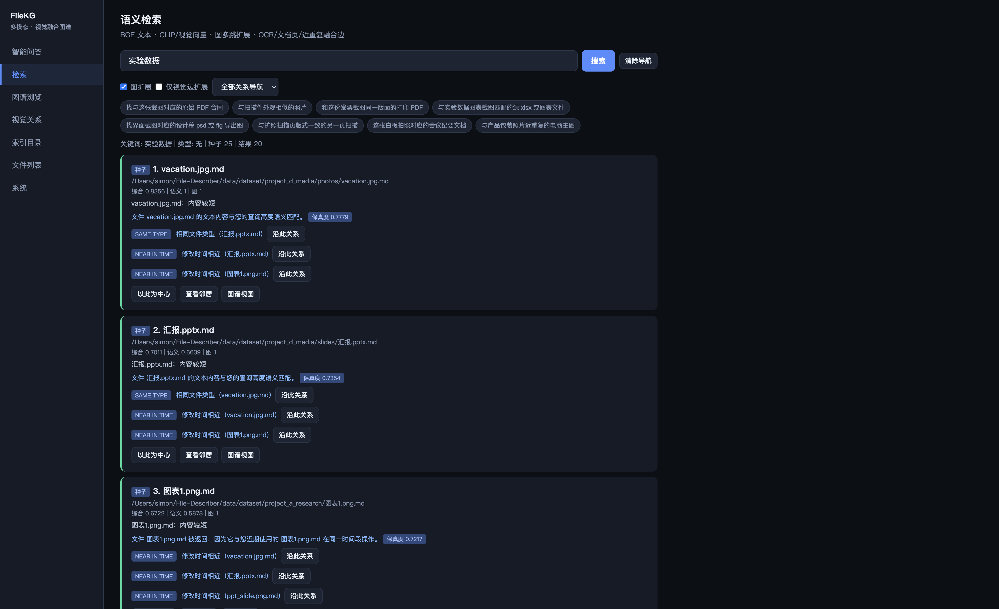
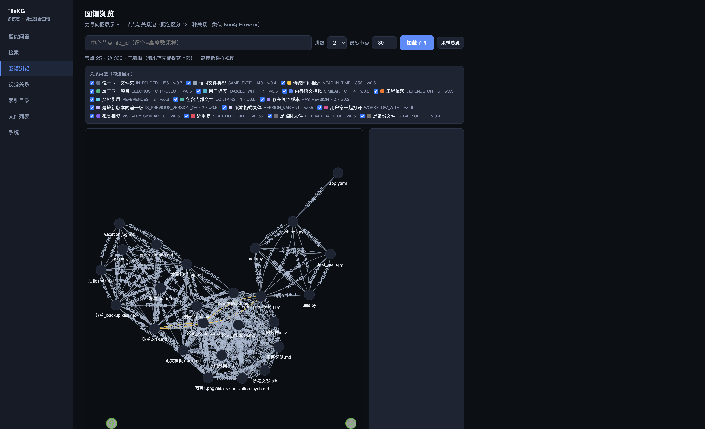
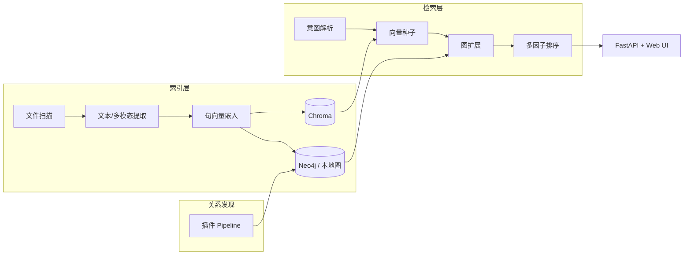

# FileKG — 个人文件知识图谱

> 仓库名 **File-Describer**，项目代号 **FileKG**（Personal File Knowledge Graph）  
> English: [README.en.md](README.en.md)

[](LICENSE)
[](https://github.com/S1M0nLEE/File-Describer/actions/workflows/ci.yml)

基于虚拟文件实体（VFE）的个人文件智能索引、检索与关系导航系统：自动发现 12+ 种文件间关系，支持「向量种子 + 图扩展 + 多因子排序」的**可解释**混合检索。

## 5 分钟体验（Quick Demo）

```bash
git clone https://github.com/S1M0nLEE/File-Describer.git
cd File-Describer
python3.12 -m venv .venv && source .venv/bin/activate   # Windows: .venv\Scripts\activate
pip install -r requirements.txt
python scripts/setup_models.py
python scripts/generate_dataset.py
python scripts/index_directory.py data/dataset --clear
python scripts/run_server.py
```

浏览器打开 **http://localhost:8765**。服务启动后会**自动后台加载**索引与检索引擎（无需手动点「确认加载」）。在检索页尝试：

- `实验数据`
- `处理实验数据的 python 代码`
- `论文最新版本`

系统会返回排序结果及**关系路径**（如 `DEPENDS_ON`、`HAS_VERSION`）。

## 界面预览

| 检索与关系路径 | 知识图谱可视化 |
|----------------|----------------|
|  |  |

> 截图由 `scripts/generate_dataset.py` + 本地索引生成。更新截图：`python scripts/run_server.py` 后访问 UI 并替换 `docs/assets/` 下 PNG。

## 核心指标（合成基准，可审计）

> **说明**：以下为离线合成 benchmark 上的 FileKG-Full 结果，非生产环境或第三方认证指标。  
> 完整溯源见 [`docs/evaluation_snapshot.json`](docs/evaluation_snapshot.json) 与 [`docs/EVALUATION.md`](docs/EVALUATION.md)。  
> 简历表述参考 [`docs/RESUME.md`](docs/RESUME.md)。

| 指标 | 数值 | 数据集 / 条件 |
|------|------|----------------|
| MAP@20 | **0.691** | `filekg_main`，238 文件 / 40 查询 |
| Serendipity@20（意外发现率） | **0.522** | `code_dependency`，15 查询 |
| volume 关系保持率 | **97.85%** | 移动 8 文件后（`file_id` 边保留率 0.9785） |

同配置下 Vector+SIMILAR_TO 在 `filekg_main` 上 MAP 略高（0.711），FileKG 优势主要体现在 **Serendipity@20** 与 **GraphDiscovery@20**（见完整 report）。

复现命令：

```bash
python scripts/generate_evaluation_benchmark.py --scale small
export FILEKG_CONFIG=config_tois_eval.yaml FILEKG_EVAL_PROFILE=tois_eval
python scripts/run_evaluation.py --dataset filekg_main --output results_tois
python scripts/run_evaluation.py --dataset code_dependency --output results_tois
python scripts/run_robustness.py --dataset filekg_main --results-dir results_tois
python scripts/export_public_metrics.py
```

原始 report 输出到本地 `data/evaluation/`（不入库）。

### 真实公开 benchmark（HippoCamp 等）

与合成 `filekg_main` 不同，以下为 **HuggingFace 公开数据集**上的离线评测：

| 数据集 | 来源 | FileKG-Full MAP@20（快照） |
|--------|------|---------------------------|
| hippocamp_adam | [MMMem-org/HippoCamp](https://huggingface.co/datasets/MMMem-org/HippoCamp) | **0.618**（328 文件 / 123 查询，`config_hippocamp_eval.yaml`） |
| hippocamp_bei | 同上 | 0.167 |
| real_github_repos | GitHub 开源仓库聚合 | 0.029 |

> 真实集 MAP **低于**合成集属正常（跨语言、个人文件分布更复杂）。  
> 摘要：[`docs/real_benchmark_snapshot.json`](docs/real_benchmark_snapshot.json) · 说明见 [`docs/EVALUATION.md`](docs/EVALUATION.md#真实公开-benchmark)

```bash
python scripts/download_hippocamp_subset.py   # 158 文件 / 18 QA
python scripts/download_real_benchmarks.py --hippocamp --subset
FILEKG_CONFIG=config_tois_eval.yaml python scripts/run_evaluation.py --registry real --dataset hippocamp_adam
python scripts/export_real_benchmark_metrics.py
```

自动化测试：`tests/test_real_benchmark.py`（metadata 进 CI；完整文件检索见 `real-benchmark` CI job）。

## 架构



| 模块 | 技术 | 职责 |
|------|------|------|
| FileDescriptor | 图节点 | 摘要、向量、生命周期、file_id |
| 向量检索 | Chroma | 分块 ANN + 文件级嵌入 |
| 关系发现 | 插件 Pipeline | 12+ 关系类型 |
| 检索 | FastAPI | 意图 → 种子 → 图扩展 → 排序 |

已实现关系：`IN_FOLDER`, `SAME_TYPE`, `NEAR_IN_TIME`, `SIMILAR_TO`, `HAS_VERSION`, `DEPENDS_ON`, `REFERENCES`, `CONTAINS`, `WORKFLOW_WITH`, `BELONGS_TO_PROJECT`, `TAGGED_WITH` 等。

## 安装

### 核心依赖（必装）

```bash
pip install -r requirements.txt
cp .env.example .env    # 可选：DEEPSEEK_API_KEY
python scripts/setup_models.py
```

| 嵌入后端 | 说明 |
|----------|------|
| `sentence_transformers` | 默认，`all-MiniLM-L6-v2`（512 维投影） |
| `fastembed` | ONNX 备选 |
| `hash` | 无模型占位，仅 CI/Docker 演示 |

### 可选：视觉 / 多模态（约 2GB+）

```bash
pip install -r requirements-visual.txt
python scripts/setup_multimodal.py   # 需本地 Ollama
```

## 日常使用

### 索引目录

```bash
python scripts/index_directory.py ~/Documents/research
# 或 API: curl -X POST http://localhost:8765/index -H 'Content-Type: application/json' -d '{"path":"/path/to/dir"}'
```

### Docker 一键演示

无需本地 Python 环境（使用 hash 嵌入，适合快速看 UI；语义检索请用上方 Quick Demo）：

```bash
chmod +x scripts/docker-demo.sh
./scripts/docker-demo.sh
# 或: docker compose up --build -d filekg
```

浏览器打开 **http://localhost:8765**。可选 Neo4j：`docker compose --profile neo4j up -d neo4j`。

### 启动服务（本地）

```bash
python scripts/run_server.py
# 默认 http://127.0.0.1:8765 — API 文档 /docs
```

> 安全：默认仅本机访问。对外暴露或 Docker 映射端口时请启用 API Token，见 [docs/SECURITY.md](docs/SECURITY.md)。

### Neo4j（可选）

无 Docker 时使用本地 `data/graph_store.json`。需要图数据库时：

```bash
docker compose --profile neo4j up -d neo4j
# http://localhost:7474  用户 neo4j / 密码见 docker-compose.yml
```

### DeepSeek RAG（可选）

在 `.env` 设置 `DEEPSEEK_API_KEY`，然后：

```bash
python scripts/setup_rag.py
python scripts/index_local_pc.py
```

## 检索示例

| 查询 | 系统行为 |
|------|----------|
| `项目A的论文最新版本` | 版本关系 + 语义排序 |
| `处理实验数据的代码` | `.py` 意图 + DEPENDS_ON 扩展 |
| `上周修改的 pdf` | 时间过滤 + 向量种子 |

## 项目结构

```
src/indexing/    扫描、提取、嵌入、file_id
src/relations/   关系发现 Pipeline
src/search/      意图解析、图扩展、排序
src/storage/     Chroma + 图存储
src/api/         FastAPI + Web UI
scripts/         索引、评测、工具
docs/            架构、Roadmap、GitHub 设置说明
tests/           单元与 smoke 测试
```

## 工程指标（CI 可验证）

| 项 | 当前 |
|----|------|
| 自动化测试 | **57**（`pytest tests/ -q`） |
| 关系发现插件 | **12+** 类型（见 `src/relations/pipeline.py`） |
| CI | lint · unit · e2e · Docker health smoke |

## 文档

- [架构说明](docs/ARCHITECTURE.md)
- [评测与指标溯源](docs/EVALUATION.md)
- [简历表述参考](docs/RESUME.md)
- [Roadmap](docs/ROADMAP.md)
- [安全说明](docs/SECURITY.md)
- [排障指南](docs/TROUBLESHOOTING.md)
- [GitHub 仓库设置](docs/GITHUB_SETUP.md)

## 测试

```bash
pytest tests/ -q              # 全部
pytest tests/ -q -m "not e2e" # 单元 / smoke
pytest tests/ -q -m e2e       # 端到端（含 HTTP 索引→检索）
ruff check src tests scripts  # 静态检查
```

CI：lint · unit · e2e · **real-benchmark (HippoCamp)** · Docker smoke。

## License

MIT — 见 [LICENSE](LICENSE)。
